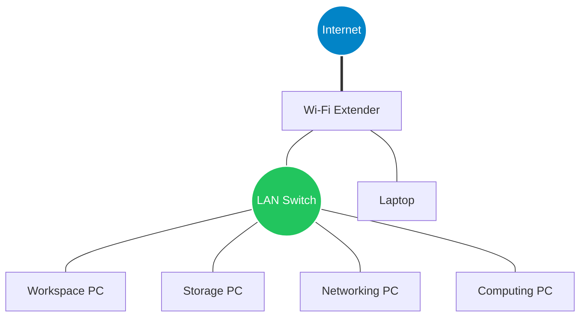
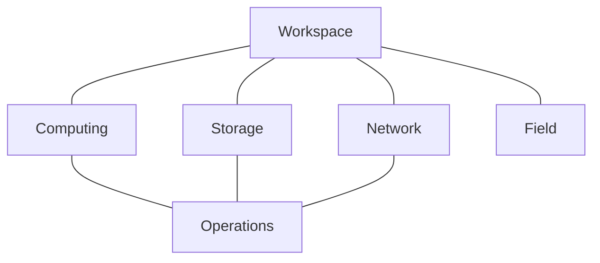

# Version 0 Architecture - (2026-07-12)
## Systems/Layers
While each layer is a modular isolated piece of the system, each should easily integrate into each while also staying true and isolated to its primary purpose. Workspace is where I interact with the ecosystem. Compute, Storage, and Network are the core infrastructure services.Operations has visibility into all of them and helps me manage them. Field connects back into the ecosystem when I'm away from my desk.
### 1. Workspace (Large Desktop 1, Laptop)
Responsible for day-to-day development and work, this is where I interact with the ecosystem. This is where I will spend most of my time writing code and working on projects. Every layer should be accessible via SSH from here
  - Coding (VSCode, Git, etc.)
  - AI Work
  - Documentation
### 2. Compute (Small desktop)
Responsible for executing workloads rather than interacting with them, keeping them running and updated. This layer should be application-agnostic
- CI/CD
- Docker
- Virtual machines
### 3. Network (Mini desktop)
Responsible for managing network tools, traffic/monitoring, security, performance, connection, and the likes. Allows me to connect anyway anytime accessing whatever I need at any point. Responsible for providing connectivity, identity, security, and observability for the computing ecosystem.
- VPN
- Network tool
- Monitoring
### 4. Storage (Large Desktop 2)
Responsible for storing, maintaining, and backing up my data, files, and more. Will also be used to store other resources so my environment can be used and viable offline
- Project files
- Mass storage
- Shared storage
- Backups and recovery
### 5. Operations (Large Desktop 1)
Responsible for providing centralized operation center for environment management. Should provide monitoring, logging, debugging, and general system management. The admin.
- Environment dashboard
- Logs, debugging, alerts, and monitoring
- Documentation
- Updates, maintainance, automations, orchestration, etc.
### 6. Field (Cyberdeck, Flipper 0)
Responsible for mobile and field operations and projects, as well as hardware tool production. Should still easily integrate with in-place system
- Cyberdeck
- Flipper
- Hardware tool manufacturing
- Portable network tools
                      
## Devices - Purpose and Communication
The main access point will be a TP-Link Wi-Fi extender that recieves its connection from the house's main router. From there I will use an ethernet cable to connect the extender to a switch that will provide hardline connection to each device. However, each layer should be accesible by the workspace via SSH.
- Large Desktop 1: Will serve as the main workspace machine. Will be where I do most of my coding and environment operations management, the HQ. Because of this, it should have connection (preferbaly as direct as possible to each device). 
- Large Desktop 2: Since it has some of the most storage, thinking it would be best for storage, it also has some of the best computing power so it may also be good elsewhere. Needs connection to all devices that will need to write and read from storage.
- Small Desktop: Not as powerful, used to manage network system. Needs to connect to all network components
- Mini Desktop: Smallest but very powerful, used for continuous computation since it is small and can be powered on 24/7. Only needs connection to HQ
- Laptop: Used for school, not a crucial component to the system. Can be easily connected and disconnected to the system.
- Cyberdeck (To come in the future): Mobile computational tool that will be a hardware project and used for in the field data colleciton, projects, and computations.
- Flipper 0: Mobile networking tool used for data collection.

## Network Topolgy

## Machine Role Table
| Hostname | Physical Device | Hardware | OS | Role | Power State |
| :--- | :---: | :---: | :---: | :---: | :---: |
| lap-main | Laptop | AMD 5, 8 GB RAM, 238 GB | Windows 11 | Current primary device | On-demand |
| ws-main | Workspace Desktop | i7, 16 GB RAM, 238 GB | Windows 11 | Main workspace/ecosystem access point | On-demand |
| sto-main | Storage Desktop | i7, 16 GB RAM, 500 GB | No OS (Wiped) | Main system storage | On-demand |
| cmp-main | Computing Desktop | i5, 8 GB RAM, 250 GB | Windows 11 | Machine to execute workloads | 24/7 |
| net-main | Network Desktop | i3, 4 GB RAM, 60 GB | Ubuntu | Machine to manage network and its communication | 24/7 |
| mob-main | Cyberdeck | Not yet defined | Not yet defined | Main field operation machine | On-demand |
| N/A | Flipper 0 | See Flipper 0 specs | Flipper OS | Field operations data collection | On-demand |

## Service Placement Table - (TODO: Update this table as services are added)
| Service | Description | Relevant Device(s) | Requirments | Status |
| :--- | :---: | :---: | :---: | :---: |

## Communication Map

